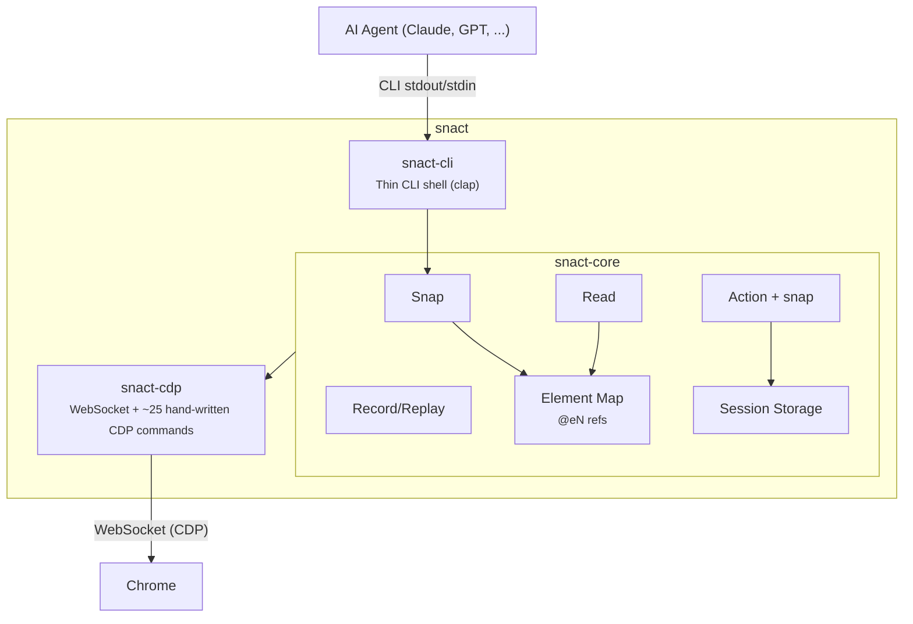

<p align="center">
  <strong>snact</strong><br>
  <em>AI agent-optimized browser CLI &mdash; snap + act</em>
</p>

<p align="center">
  <a href="https://github.com/vericontext/snact/actions/workflows/ci.yml"></a>
  <a href="https://github.com/vericontext/snact/releases/latest"></a>
  <a href="LICENSE"></a>
</p>

---

snact lets AI agents control browsers with extreme token efficiency. One `snap` returns page structure, section content, and every actionable element &mdash; enough for an LLM to understand and act in a single turn.

```
$ snact snap https://www.apple.com/shop/buy-mac/macbook-pro

# Buy MacBook Pro

## Model. Choose your size.
> 14-inch — From $1,699 or $141.58/mo. | 16-inch — From $2,699 or $224.91/mo.
@e35 [input:radio] "14-inch" selected
@e36 [input:radio] "16-inch"

## Chip. Choose from these powerful options.
> M5 Pro — 12-core CPU, 16-core GPU | M5 Max — 16-core CPU, 40-core GPU
@e40 [link]

$ snact click @e36
ok
---
## Model. Choose your size.                    # ← auto re-snap included
> 16-inch — Available with M5 Pro or M5 Max
@e35 [input:radio] "14-inch"
@e36 [input:radio] "16-inch" selected
```

Every action automatically returns a fresh page snapshot &mdash; no manual re-snap needed.

## Benchmark

https://github.com/user-attachments/assets/544718bf-747a-446a-896a-f2c5c376f3d7

<sup>Both sides played at 16x speed. Left: Playwright MCP (5m 17s real time). Right: snact CLI (2m 39s real time).</sup>

| | snact CLI | Playwright CLI | Playwright MCP |
|--|-----------|----------------|----------------|
| **Time** | **2m 39s** | 5m 10s | 5m 17s |
| **Total tokens** | **34.1K (17%)** | 35.4K (18%) | 88K (44%) |
| **Message tokens** | **18.8K** | 20.1K | 73.4K |
| **Data accuracy** | Correct | Correct | Correct |

snact finished in half the time with half the tokens. All three produced identical data. See [detailed analysis](#detailed-benchmark-analysis).

## Why snact?

|  | Playwright MCP | Playwright CLI | snact |
|--|----------------|----------------|-------|
| **Architecture** | Persistent MCP server | Daemon + CLI | **Stateless CLI** |
| **After click/fill** | Snapshot in response | Manual re-snapshot | **Snapshot in response** |
| **Tokens per page** | ~3K-50K | ~1K-13K | **~50-4K** (measured) |
| **Repeated tasks** | Full LLM call | Full LLM call | **0** (workflow replay) |
| **Session persistence** | Config-based | `--persistent` flag | **`session save/load`** |
| **Cron automation** | Requires LLM API | Requires LLM API | **Shell one-liner** |
| **Locale/Geo override** | Via `run-code` | Via config | **`--locale` / `--geo` flags** |
| **Install** | npm + Playwright | npm + Playwright | **Single binary** (Rust) |
| **Multi-browser** | Chromium/FF/WebKit | Chromium/FF/WebKit | Chrome only |

## Installation

```bash
# One-line install (macOS / Linux)
curl -fsSL https://raw.githubusercontent.com/vericontext/snact/main/install.sh | bash

# From source
cargo install --path crates/snact-cli

# Verify
snact --version
```

## Quick start

### 1. Launch Chrome

```bash
snact browser launch --background
# Persistent profile — cookies and login state survive restarts
# Use --profile=work for separate profiles
# Use --idle-timeout=30 to auto-stop after 30 min of inactivity
```

### 2. Snap &mdash; structure + content + elements

```bash
snact snap https://github.com/trending
```

```
# Trending

## NousResearch / hermes-agent
> The agent that grows with you | Python | Star
@e28 [link] href="/NousResearch/hermes-agent"

## microsoft / markitdown
> Python tool for converting files and office documents to Markdown. | Python | Star
@e37 [link] href="/microsoft/markitdown"
```

Section headings group elements. `>` lines summarize content. Each `@eN` reference is stable until the next snap.

### 3. Act &mdash; actions return updated state

```bash
snact click @e28
```

```
ok
---
# NousResearch/hermes-agent
> The agent that grows with you. Build AI agents...
@e1 [link] "Code" href="/NousResearch/hermes-agent"
@e2 [link] "Issues" href="/NousResearch/hermes-agent/issues"
...
```

Every mutation (click, fill, type, select, scroll) returns a fresh snap. Use `--no-snap` to disable.

### 4. Read &mdash; full text content

```bash
snact read https://example.com --focus="main"
```

```
# Example Domain
This domain is for use in documentation examples.
Learn more
```

`snap` = structure + elements + summaries. `read` = full text when you need more detail.

### 5. Eval &mdash; custom JavaScript

When snap/read can't capture dynamic content (e.g. Amazon product cards):

```bash
snact eval "JSON.stringify(Array.from(document.querySelectorAll('.product')).map(p => ({
  title: p.querySelector('h2')?.textContent,
  price: p.querySelector('.price')?.textContent
})))"
```

### 6. Session &mdash; persist browser state

```bash
snact session save github           # cookies + localStorage
snact session load github           # restore later
```

### 7. Record & Replay &mdash; zero LLM cost

```bash
snact record start login-flow
snact snap https://app.example.com/login
snact fill @e1 "user@example.com" --no-snap
snact click @e3 --no-snap
snact wait navigation
snact record stop

# Day 2, 3, 4... — no LLM, no tokens, ~100ms
snact replay login-flow
```

## Commands

| Command | Description |
|---------|-------------|
| `snap [url]` | Page structure + section summaries + interactable elements |
| `read [url]` | Full visible text as structured markdown |
| `click <@ref>` | Click element (returns updated snap) |
| `fill <@ref> <value>` | Set input value (returns updated snap) |
| `type <@ref> <text>` | Type character by character (returns updated snap) |
| `select <@ref> <value>` | Select dropdown option (returns updated snap) |
| `scroll [direction]` | Scroll page (returns updated snap) |
| `eval <expression>` | Execute JavaScript on the page |
| `screenshot [--file]` | Capture page as PNG |
| `wait <condition>` | Wait for navigation, CSS selector, or timeout (ms) |
| `session save\|load\|list\|delete` | Manage browser sessions |
| `record start\|stop\|list\|delete` | Record command sequences |
| `replay <name>` | Replay a recorded workflow |
| `browser launch\|stop\|status` | Manage Chrome instance |
| `schema [command]` | JSON Schema introspection |
| `mcp` | Start MCP server (JSON-RPC over stdio) |
| `init` | Create AGENT.md for Claude Code skill discovery |

### Global flags

```
--port <PORT>       Chrome debugging port [default: 9222]
--output <FMT>      Output format: text, json, ndjson [default: text]
--dry-run           Preview action without executing
--no-snap           Skip automatic re-snap after actions
--profile <NAME>    Browser profile name [default: "default"] (browser launch)
--idle-timeout <MIN> Auto-stop Chrome after N minutes of inactivity (browser launch)
--lang <LANG>       Accept-Language header [default: en-US]
--locale <LOCALE>   JS navigator.language override (e.g. en-US, ja-JP)
--geo <LAT,LON>     Geolocation override (e.g. "37.7749,-122.4194")
--user-agent <UA>   Custom User-Agent string
--focus <SEL>       CSS selector to limit scope (snap/read)
--verbose           Debug logging
```

## AI agent integration

### Claude Code

snact works as a native CLI tool &mdash; no MCP configuration needed:

```bash
snact browser launch --background
claude
# "Use snact to find the MacBook Pro M4 Pro price on apple.com"
```

Run `snact init` in your project directory to create an AGENT.md skill file for Claude Code.

### MCP server

For Claude Desktop or any MCP client:

```json
{
  "mcpServers": {
    "snact": {
      "command": "snact",
      "args": ["mcp"]
    }
  }
}
```

### Piped / scripted

```bash
snact snap https://example.com --output=json | jq '.elements | keys[]'
snact snap https://example.com --output=ndjson
```

## Architecture



**Three-crate workspace** &mdash; `cdp` handles Chrome protocol, `core` is the library, `cli` is a thin shell.

<details>
<summary>How contextual snap works</summary>

1. **`DOMSnapshot.captureSnapshot`** &mdash; Full flattened DOM including Shadow DOM
2. **`Accessibility.getFullAXTree`** &mdash; Semantic roles, names, descriptions, properties
3. **Merge** &mdash; Join DOM nodes with AX nodes by `backendNodeId`
4. **Extract context** &mdash; Headings, text blocks (DOM + JS fallback for SPAs)
5. **Filter** &mdash; Keep only interactable elements, exclude hidden/aria-hidden
6. **Compress** &mdash; Group by section headings, add content summaries, assign `@eN` refs

</details>

<details>
<summary>Auto re-snap after actions</summary>

Every mutation action (click, fill, type, select, scroll) automatically:

1. Executes the action via CDP
2. **Waits for settle** &mdash; detects navigation (waits for page load, 3s timeout) or SPA mutation (300ms settle)
3. **Takes a fresh snap** on the same transport connection
4. Returns `ok\n---\n{snap output}` so the LLM sees updated state in one turn

</details>

<details>
<summary>Snap output format reference</summary>

```
## Section Heading
> Content summary: prices, options, descriptions (up to 300 chars)
@e1 [role] "label" id="..." href="..." expanded desc="Opens in new tab"
@e2 [input:text] "Search" placeholder="..." required
```

| Component | Purpose |
|-----------|---------|
| `## Heading` | Page section structure (h1-h6) |
| `> summary` | Key text content from that section |
| `@eN` | Stable element reference for actions |
| `[role]` | Semantic role (button, link, textbox, etc.) |
| `"label"` | Accessible name |
| `id=`, `href=` | Key attributes |
| `expanded`, `collapsed` | Dropdown/accordion state |
| `selected` | Active tab/option |
| `required`, `readonly` | Form field constraints |
| `desc="..."` | Accessibility description |

</details>

### Design decisions

- **Hand-written CDP types** over generated bindings &mdash; ~25 commands, fast compile
- **Disk-based state** between invocations &mdash; element maps, sessions, workflows as JSON
- **`backendNodeId`** as element identifier &mdash; stable within a page load, selector hints for replay
- **Text output by default** &mdash; optimized for LLM comprehension, not JSON parsing
- **Persistent browser profiles** &mdash; cookies survive restarts, reduces bot detection
- **Single-threaded tokio** &mdash; one thing at a time

## Data storage

**User scope** &mdash; `~/.local/share/snact/` (Linux) or `~/Library/Application Support/snact/` (macOS):

```
snact/
├── element_map.json        # Current @eN → element mappings
├── heartbeat               # Last command timestamp (for --idle-timeout)
├── chrome-{port}.pid       # Chrome process ID
├── profiles/default/       # Persistent Chrome profile
├── sessions/{name}.json    # Saved browser sessions
├── workflows/{name}.json   # Recorded workflows (personal)
└── recording.json          # Active recording state
```

**Project scope** &mdash; `.snact/` in the project directory (created by `snact init`, git-committable):

```
.snact/
└── workflows/{name}.json   # Shared workflows (team/repo)
```

Workflows save to project scope when `.snact/` exists, otherwise user scope. On load, project scope takes priority.

## Detailed benchmark analysis

> Task: Visit npmjs.com for 10 React state management libraries (zustand, jotai, recoil, valtio, mobx, redux, xstate, effector, nanostores, legend-state). Collect weekly downloads, last publish date, unpacked size, and dependencies.

**Speed:** snact finished in half the time (2m 39s vs ~5m). Both Playwright approaches took similar time (~5m 10-17s).

**Token efficiency:** snact and Playwright CLI used similar total tokens (~34-35K), but Playwright MCP consumed 2.5x more (88K) due to accessibility tree snapshots accumulating in context. MCP's message tokens alone (73.4K) were 3.9x higher than snact's (18.8K).

**Answer quality:** All three produced identical data. Minor format differences: snact used relative dates and abbreviated downloads; Playwright CLI provided absolute dates; Playwright MCP included exact download counts.

<details>
<summary>Per-page token measurements</summary>

Measured with `wc -c / 4` on actual snap output (1 token &approx; 4 chars):

| Site | snact (full) | snact (`--focus`) |
|------|-------------|-------------------|
| example.com | 46 | &mdash; |
| GitHub Login | 172 | 60 |
| GitHub Trending | 2,152 | 614 |
| Hacker News | 2,670 | &mdash; |
| Apple MacBook Pro | 2,546 | &mdash; |
| StackOverflow | 4,363 | &mdash; |
| NYTimes | 2,417 | &mdash; |

Simple pages: 50-200 tokens. Typical pages: 2K-4K. With `--focus`: 60-600.

Playwright token estimates from [scrolltest.medium.com](https://scrolltest.medium.com/playwright-mcp-burns-114k-tokens-per-test-the-new-cli-uses-27k-heres-when-to-use-each-65dabeaac7a0) (MCP ~114K per test session, CLI ~27K). snact numbers are directly measured.

</details>

## Contributing

See [CONTRIBUTING.md](CONTRIBUTING.md) for development setup, project structure, and commit conventions.

## License

MIT
